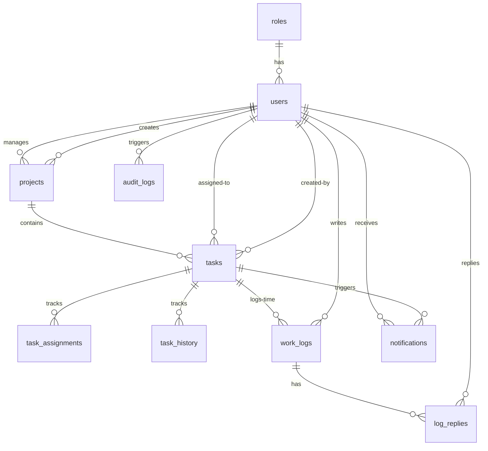

# RoleTrack — Role-Based Project & Task Management System

RoleTrack is a secure, enterprise-grade project and task management system featuring a layered architecture, real-time notifications, strict role-based access controls, automatic background cron scheduling, and comprehensive audit history trails. 

Built using a modern TypeScript full-stack environment, the backend is powered by **Node.js, Express, Sequelize ORM, and MySQL**, while the frontend is constructed using **React (v19), Vite, Zustand, TanStack Query, and Tailwind CSS (v4.0)**.

---

## Table of Contents

- [1. Technical Stack Overview](#1-technical-stack-overview)
- [2. Architecture Decisions & Design Patterns](#2-architecture-decisions--design-patterns)
  - [Backend Layered Architecture](#backend-layered-architecture)
  - [Relational Database Design](#relational-database-design)
  - [Role-Based Access Control (RBAC)](#role-based-access-control-rbac)
  - [Real-Time WebSocket Architecture](#real-time-websocket-architecture)
  - [Automated Background Scheduler](#automated-background-scheduler)
  - [Security & Session Management](#security--session-management)
  - [Audit Logging & Change History](#audit-logging--change-history)
  - [Frontend Architecture](#frontend-architecture)
- [3. Database Schema & Assumptions](#3-database-schema--assumptions)
  - [Database Tables Reference](#database-tables-reference)
  - [System Assumptions](#system-assumptions)
- [4. Local Setup Guide](#4-local-setup-guide)
  - [Prerequisites](#prerequisites)
  - [Database Initialization](#database-initialization)
  - [Backend Setup](#backend-setup)
  - [Frontend Setup](#frontend-setup)
- [5. Getting Started Workflow](#5-getting-started-workflow)
- [6. Docker Deployment Guide](#6-docker-deployment-guide)
  - [Orchestration Topology](#orchestration-topology)
  - [Deployment Steps](#deployment-steps)
- [7. API Endpoint Directory](#7-api-endpoint-directory)
- [8. Troubleshooting](#8-troubleshooting)

---

## 1. Technical Stack Overview

| Layer | Technology | Key Libraries / Frameworks |
|---|---|---|
| **Frontend** | React 19 (TypeScript), Vite | Zustand, TanStack Query, React Router DOM v7, React Hook Form, Zod |
| **Styling** | Vanilla CSS + Tailwind CSS v4.0 | `@tailwindcss/vite` plugin, Lucide React (Icons), React Hot Toast |
| **Backend** | Node.js (TypeScript), Express | Sequelize (ORM), Socket.io, Node-cron, Multer, Nodemailer |
| **Database** | MySQL 8.0 | `mysql2` driver, indexing strategy, foreign key integrity |
| **Containerization** | Docker, Docker Compose | Alpine-based Node environments, Nginx reverse proxy |

---

## 2. Architecture Decisions & Design Patterns

### Backend Layered Architecture
The backend code follows a structured **Controller-Service-Model** pattern, enforcing a clean separation of concerns:
- **Routes Layer**: Exposes REST API routes, validates parameters using `express-validator` and `validate` middleware, and routes requests to controllers.
- **Middleware Layer**: Enforces security policies (rate limits, Helmet headers), parses file uploads (Multer), verifies JWT tokens (`authenticate`), and performs access checks (`authorize`).
- **Controllers Layer**: Coordinates the incoming HTTP requests, handles payloads, delegates business logic execution, calls the audit service, and formats JSON responses.
- **Services Layer**: Handles complex business processes, triggers email deliveries, performs background cron checks, and executes real-time socket events.
- **Models Layer**: Defines Sequelize schemas and data associations, enabling structured querying of MySQL database tables.

### Relational Database Design
A fully-normalized relational model database is utilized:
- **Foreign Key Constraints**: Cascades deletions on dependent items (e.g., deleting a task cascades to `task_assignments`, `task_history`, and `work_logs`). Assignees are set to `NULL` if a user is deleted, keeping historical logs intact.
- **Performance Indexing**: Indexes are placed on foreign keys (`project_id`, `assigned_to`, `user_id`, `role_id`), unique columns (`email`), deletion trackers (`deleted_at`), and status/deadline columns to support sub-millisecond query execution on highly filtered search views.
- **Soft Deletion (`deleted_at` pattern)**: Applied to `users`, `projects`, and `tasks`. Data is never deleted from raw tables; instead, queries filter out deleted rows by default, maintaining chronological history for audits.

### Role-Based Access Control (RBAC)
Strict access levels are enforced dynamically across endpoints:
1. **Admin**: Global administrative control. Only Admins can manage users, create projects, assign project managers, and view the complete system audit logs.
2. **Project Manager**: Limited to managing projects specifically assigned to them. They can view, create, edit, or archive tasks inside their projects and reply to team members' work logs. They cannot access other managers' projects or alter user roles.
3. **Employee**: Restricted to viewing and modifying tasks assigned directly to them. Employees can update a task's status and log work hours with optional attachments. They cannot edit task metadata (like deadlines, title, or estimates).

### Real-Time WebSocket Architecture
Real-time state synchronization is established via **Socket.io**:
- Handshakes are authorized using the client's JWT access token via custom Socket.io middleware.
- On connection, sockets map `userId` to `socketId` in-memory.
- Notifications created in the backend automatically fire socket events targeting the recipient if they are online, resulting in instant client dashboard updates without polling.

### Automated Background Scheduler
A persistent background scheduler runs inside the Node server via `node-cron`:
- **Deadline Checker**: Runs every 5 minutes, scanning tasks due in exactly 48h, 24h, 12h, or 1h. It dispatches push alerts and email notifications. In short windows (≤ 24h), the assigned Project Manager is also notified.
- **Overdue Checker**: Runs every 10 minutes, identifying tasks whose deadlines have elapsed. It marks alerts and emails both the assignee and their project manager.
- **Deduplication Check**: Prevents duplicate reminders by verifying existing notification logs (`task_id` + `type`) before sending a new alert.

### Security & Session Management
- **Token Strategy**: Uses short-lived Access Tokens (15 minutes) passed in the `Authorization` header, and long-lived Refresh Tokens (7 days) to silently renew sessions.
- **Password Hashing**: Implemented using **bcryptjs** with a cost factor of 12 rounds.
- **Rate Limiting**: Employs `express-rate-limit` to restrict brute-force attacks (10 attempts per 15 minutes on auth routes; 120 requests per minute on general API routes).
- **HTTP Headers**: Enforced via `helmet` to mitigate cross-site scripting (XSS), clickjacking, and mime-type sniffing.

### Audit Logging & Change History
To guarantee accountability, three layers of change tracking exist:
1. **Task Assignment Trail (`task_assignments`)**: Records assignment events, capturing who assigned a task to whom, when, and arbitrary notes.
2. **Task History Logs (`task_history`)**: Stores field-level updates (e.g., changes to status, priority, title, or deadline) with previous and new values.
3. **System-wide Audit Logs (`audit_logs`)**: Captures security and mutation events (login, user registration, project creation, soft deletion) along with before/after state snapshots in a JSON column, including user IP addresses.

### Frontend Architecture
- **State Management**: Built using **Zustand** for lightweight store state (`authStore`, `themeStore`) with local storage persistence.
- **Data Fetching & Cache**: Managed by **TanStack Query (React Query)** to handle caching, auto-refetching, and query mutations.
- **Token Renewal Interceptor**: An Axios responder detects `401 Unauthorized` requests, queues concurrent actions, resolves a new access token via `/api/auth/refresh`, and transparently retries the failed requests. If renewal fails, the session is cleared, routing the client to the login screen.
- **Theme Engine**: Restores the user's preference (dark or light mode) on boot, falling back to system preference if no user setting is saved.

---

## 3. Database Schema & Assumptions

### Database Tables Reference



- **`roles`**: System groups: `admin`, `project_manager`, `employee`.
- **`users`**: User profiles with soft-delete (`deleted_at`) and activation status toggles.
- **`projects`**: Projects defined by date ranges, statuses, and assigned managers.
- **`tasks`**: Task items linked to a project, holding status, priority, and deadlines.
- **`task_assignments`**: Real-time tracking of assignees and history of assignment changes.
- **`task_history`**: Audit trail of field mutations on tasks.
- **`work_logs`**: Logs time submitted by Employees, containing descriptions and optional attachments.
- **`log_replies`**: Threaded replies by Project Managers or Admins on Employee work logs.
- **`notifications`**: System alerts mapped to users and tasks.
- **`audit_logs`**: Immutable history records detailing user mutations, previous values, and request metadata.

### System Assumptions
1. **User Management**: There is no public registration form. All accounts are created and provisioned by the Administrator.
2. **Project Assignment**: A Project can have exactly one assigned Project Manager. The Project Manager can access and modify tasks only inside their assigned projects.
3. **Task Completion**: Only the assigned employee, the project's manager, or the Admin can modify a task's status. Employees can only update the status field and cannot alter other parameters.
4. **Time Tracking**: Employees can log work hours between 0.1 and 24 hours per submission. Time logs cannot be modified once saved, but they can be commented on in threaded conversations.

---

## 4. Local Setup Guide

### Prerequisites
Make sure the following dependencies are installed:

| Dependency | Minimum Version | Verified Version | Download Link |
|---|---|---|---|
| **Node.js** | 18.x | 20.x | [NodeJS Downloads](https://nodejs.org) |
| **npm** | 9.x | 10.x | Included with Node.js |
| **MySQL** | 8.0 | 8.0.x | [MySQL Community Server](https://dev.mysql.com/downloads/) |

---

### Database Initialization

1. Start your local MySQL service.
2. Connect to the database shell as root:
   ```bash
   mysql -u root -p
   ```
3. Load the database schema and seed data:
   ```bash
   mysql -u root -p < backend/src/database/schema.sql
   ```
   *This initializes the `task_manager` database, maps default roles, and seeds an admin user account (`admin@taskmanager.com`).*

4. **Set Up the Admin Password**:
   The seed file contains a dummy password hash. You must generate a secure bcrypt hash for the password `Admin@123` and update the database record. Run the following command inside the `backend/` directory:
   ```bash
   cd backend
   node -e "require('bcryptjs').hash('Admin@123', 12).then(h => console.log(h))"
   ```
   Copy the generated hash from the terminal, open your MySQL console, and run:
   ```sql
   USE task_manager;
   UPDATE users SET password_hash = 'YOUR_GENERATED_HASH' WHERE email = 'admin@taskmanager.com';
   ```

---

### Backend Setup

1. Navigate to the backend directory and install dependencies:
   ```bash
   cd backend
   npm install
   ```
2. Create a local `.env` configuration file:
   ```bash
   cp .env.example .env   # Or create it manually
   ```
   Fill in the file using this template:
   ```env
   PORT=5000
   DB_HOST=localhost
   DB_PORT=3306
   DB_NAME=task_manager
   DB_USER=root
   DB_PASSWORD=your_mysql_password

   # JWT Config (Generate 32+ character keys)
   JWT_SECRET=8dXq2kN91LzYvA4QmP7rTwK3sUxJ6bHf
   JWT_REFRESH_SECRET=H3wP9mJ6xQnK5sT2zLcR8vDfY1aU4eBg
   JWT_EXPIRES_IN=15m
   JWT_REFRESH_EXPIRES_IN=7d

   # SMTP Mail Configuration
   EMAIL_HOST=smtp.gmail.com
   EMAIL_PORT=587
   EMAIL_USER=your_email@gmail.com
   EMAIL_PASS=your_gmail_app_password
   EMAIL_FROM=Task Manager <your_email@gmail.com>

   # Client Integration
   CLIENT_URL=http://localhost:5173
   UPLOAD_DIR=uploads
   ```
3. Create the uploads directory:
   ```bash
   mkdir uploads
   ```
4. Start the backend development server:
   ```bash
   npm run dev
   ```
   *The backend will boot on **http://localhost:5000**. The console will log database connection success and the start of the scheduler daemon.*

---

### Frontend Setup

1. Navigate to the frontend directory and install dependencies:
   ```bash
   cd ../frontend
   npm install
   ```
2. Start the Vite development server:
   ```bash
   npm run dev
   ```
   *The application will boot on **http://localhost:5173**.*

---

## 5. Getting Started Workflow

To verify your installation and configure your work environment, follow this bootstrap procedure:

1. **Log in as Admin**: Open `http://localhost:5173/login` and authenticate using:
   - **Email**: `admin@taskmanager.com`
   - **Password**: `Admin@123`
2. **Provision Accounts**: Navigate to the **Users** view and click **Create User** to create:
   - A **Project Manager** (e.g., `pm@taskmanager.com`)
   - An **Employee** (e.g., `employee@taskmanager.com`)
3. **Register a Project**: Navigate to the **Projects** view, click **Create Project**, fill out the project details, and assign the created Project Manager.
4. **Create & Assign Tasks**: Log out and log back in as the **Project Manager** (or remain as Admin). Go to the **Tasks** panel, click **Create Task**, attach it to the project, set the deadline, and assign it to the created **Employee**.
5. **Log Progress**: Log in as the **Employee**. You will see the task on your dashboard. Open the task, update the status to `In Progress`, and click **Add Work Log** to submit logged hours and description updates.
6. **Collaborate**: Log back in as the **Project Manager**. Go to the task details or **Work Logs** panel, review the employee's logs, and add a reply to establish a conversation thread.

---

## 6. Docker Deployment Guide

The project includes pre-configured Dockerfiles and a `docker-compose.yml` to orchestrate the backend, frontend, and database in containerized environments.

### Orchestration Topology
- **`mysql` container**: Runs MySQL 8.0, persisting database files to a local Docker volume (`mysql_data`). Sounces the schema and seeds from `schema.sql` automatically at boot. Exposes port `3307` locally.
- **`backend` container**: Compiles and runs the Express server on Node 20. Persists attachments to a volume (`uploads_data`). Exposes port `5000`.
- **`frontend` container**: Builds the static client bundle and serves it using Nginx. It binds to port `80` (HTTP) and proxies API, WebSocket, and upload requests transparently to the backend container.

```
                  ┌───────────────┐
                  │  Web Browser  │
                  └───────┬───────┘
                          │ Port 80 (HTTP)
                          ▼
            ┌───────────────────────────┐
            │   Nginx (Frontend Pod)    │
            └────┬──────────────────┬───┘
                 │                  │
                 │ /api & /socket   │ /uploads
                 ▼                  ▼
      ┌────────────────────────────────┐
      │   NodeJS Express (Backend)     │
      └──────────────────┬─────────────┘
                         │ Port 3306
                         ▼
               ┌──────────────────┐
               │    MySQL 8.0     │
               └──────────────────┘
```

---

### Deployment Steps

1. Create a root `.env.docker` file. This environment file feeds environment variables into Docker Compose. It is recommended to use the following structure:
   ```env
   JWT_SECRET=8dXq2kN91LzYvA4QmP7rTwK3sUxJ6bHf
   JWT_REFRESH_SECRET=H3wP9mJ6xQnK5sT2zLcR8vDfY1aU4eBg
   EMAIL_HOST=smtp.gmail.com
   EMAIL_PORT=587
   EMAIL_USER=your_email@gmail.com
   EMAIL_PASS=your_gmail_app_password
   EMAIL_FROM=Task Manager <your_email@gmail.com>
   ```

2. Boot the containers:
   ```bash
   docker compose --env-file .env.docker up --build -d
   ```
   *This command builds the frontend and backend images, starts MySQL, initializes the schema, and starts the applications in the background.*

3. Open the application:
   Navigate to **`http://localhost`** in your browser.
   
4. **Initialize Docker Database Admin Password**:
   Just like in local setup, you need to hash the admin password for the Docker database. Because the Docker container exposes the MySQL service on port **`3307`**, run the update query against `127.0.0.1:3307`:
   
   - Generate the password hash:
     ```bash
     node -e "require('bcryptjs').hash('Admin@123', 12).then(h => console.log(h))"
     ```
   - Connect to the container's MySQL database (or use your host mysql client directed at port `3307`):
     ```bash
     mysql -h 127.0.0.1 -P 3307 -u root -prootpassword
     ```
   - Update the password:
     ```sql
     USE task_manager;
     UPDATE users SET password_hash = 'YOUR_GENERATED_HASH' WHERE email = 'admin@taskmanager.com';
     ```

5. **Stop the environment**:
   To stop all services and preserve data:
   ```bash
   docker compose down
   ```
   To stop services and delete the database volume:
   ```bash
   docker compose down -v
   ```

---

## 7. API Endpoint Directory

All API requests (except `/auth/login`, `/auth/refresh`, `/auth/forgot-password`, `/auth/reset-password`, and `/health`) require authentication. Send your access token in the `Authorization` header as `Bearer <token>`.

### Authentication Endpoints
| Method | Endpoint | Allowed Roles | Description |
|---|---|---|---|
| **POST** | `/api/auth/login` | Public | Authenticate and get Access & Refresh tokens. |
| **POST** | `/api/auth/refresh` | Public | Issue a new access token using a refresh token. |
| **POST** | `/api/auth/logout` | Authenticated | Terminate user session. |
| **POST** | `/api/auth/forgot-password` | Public | Send password reset link to user email. |
| **POST** | `/api/auth/reset-password` | Public | Reset password using a valid email token. |
| **GET** | `/api/auth/me` | Authenticated | Fetch current user profile details. |

### Project Endpoints
| Method | Endpoint | Allowed Roles | Description |
|---|---|---|---|
| **GET** | `/api/projects` | Authenticated | List projects. PMs only see their assigned projects; Employees see none. |
| **GET** | `/api/projects/:id` | Authenticated | Get detailed project view. |
| **POST** | `/api/projects` | Admin | Register a new project. |
| **PUT** | `/api/projects/:id` | Admin, PM | Update project details (PM can only update their own project). |
| **DELETE** | `/api/projects/:id` | Admin | Soft-delete a project. |

### Task Endpoints
| Method | Endpoint | Allowed Roles | Description |
|---|---|---|---|
| **GET** | `/api/tasks` | Authenticated | List tasks. Filters applied by role. |
| **GET** | `/api/tasks/:id` | Authenticated | Get task details including assignment & change history. |
| **GET** | `/api/tasks/:id/history` | Authenticated | Fetch task modification logs. |
| **GET** | `/api/tasks/:id/assignments` | Authenticated | Fetch assignment trail of a task. |
| **POST** | `/api/tasks` | Admin, PM | Create a new task. |
| **PUT** | `/api/tasks/:id` | Authenticated | Update task. Employees can only modify `status`. |
| **DELETE** | `/api/tasks/:id` | Admin, PM | Soft-delete a task. |

### Work Log Endpoints
| Method | Endpoint | Allowed Roles | Description |
|---|---|---|---|
| **GET** | `/api/work-logs` | Authenticated | List all filtered work logs. |
| **GET** | `/api/work-logs/task/:task_id` | Authenticated | Fetch work logs associated with a task. |
| **POST** | `/api/work-logs` | Authenticated | Post a work log (accepts multipart/form-data for uploads). |
| **POST** | `/api/work-logs/:log_id/reply` | Admin, PM | Post a reply to a work log. |

### User Endpoints
| Method | Endpoint | Allowed Roles | Description |
|---|---|---|---|
| **GET** | `/api/users` | Admin, PM | List users. PMs only see Employees. |
| **GET** | `/api/users/:id` | Admin | Fetch user profile detail by ID. |
| **GET** | `/api/users/:id/workload` | Admin, PM | Check active tasks load of a user. |
| **POST** | `/api/users` | Admin | Create a new user account. |
| **PUT** | `/api/users/:id` | Admin | Update user details (name, email, role, status). |
| **DELETE** | `/api/users/:id` | Admin | Deactivate user account (soft delete). |

### Notification Endpoints
| Method | Endpoint | Allowed Roles | Description |
|---|---|---|---|
| **GET** | `/api/notifications` | Authenticated | Fetch user's notification list. |
| **GET** | `/api/notifications/unread-count` | Authenticated | Count unread notifications. |
| **PUT** | `/api/notifications/:id/read` | Authenticated | Mark a notification as read. |
| **PUT** | `/api/notifications/read-all` | Authenticated | Mark all notifications as read. |

### Report Endpoints
| Method | Endpoint | Allowed Roles | Description |
|---|---|---|---|
| **GET** | `/api/reports/overview` | Admin | Fetch system-wide metrics and stats. |
| **GET** | `/api/reports/project/:id` | Admin, PM | Fetch project statistics and breakdowns. |
| **GET** | `/api/reports/employee/:id` | Admin, PM | Fetch employee time logs and completion metrics. |

### Audit Log Endpoints
| Method | Endpoint | Allowed Roles | Description |
|---|---|---|---|
| **GET** | `/api/audit-logs` | Admin | Fetch system change logs (paginated and filterable). |

---

## 8. Troubleshooting

### Database Connection Failure
- **Error**: `DB connection failed: DialectNeedsMySQL2Error` or `ConnectionRefused`
- **Solution**:
  - Verify that MySQL is running on your host machine.
  - Verify that the port config in your `.env` matches the MySQL listening port (normally `3306` for local install, `3307` for Docker container on host).
  - Double check your `DB_PASSWORD` value.

### Authentication Failures
- **Error**: `Invalid Credentials` on Admin Login
- **Solution**: Sourcing `schema.sql` creates a seed user with a placeholder password hash. Ensure you ran the script in [Database Initialization](#database-initialization) to overwrite the `password_hash` column with a newly generated hash for the password `Admin@123`.

### Email Delivery Failure
- **Error**: Emails are not sent, or SMTP timeouts occur.
- **Solution**:
  - Verify your Google Account security settings. If utilizing Gmail, you must enable **2-Step Verification** and generate a custom **App Password** for mail.
  - Update `EMAIL_PASS` in your `.env` file with the generated 16-character app password (without spaces), not your main account password.

### File Upload Failures
- **Error**: Files are not saved or endpoint returns error codes on submission.
- **Solution**:
  - Check that the `backend/uploads/` directory exists and has write permissions.
  - Verify that the uploaded file size is less than 10MB.
  - Ensure that the file extension is allowed (allowed: `jpeg`, `jpg`, `png`, `gif`, `pdf`, `doc`, `docx`, `txt`, `zip`).

### CORS Exceptions
- **Error**: Requests blocked by Cross-Origin Resource Sharing.
- **Solution**: Verify that `CLIENT_URL` in `backend/.env` matches the exact URL of your running frontend application (normally `http://localhost:5173` for local Vite, or `http://localhost` for Docker).